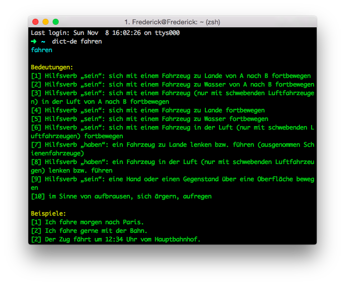

# dict-de [](https://circleci.com/gh/Frederick-S/dict-de)
German dictionary in terminal.

## Installation
```
$ [sudo] npm install dict-de -g
```

## Usage
```
$ dict-de fahren
```



## License
MIT.
